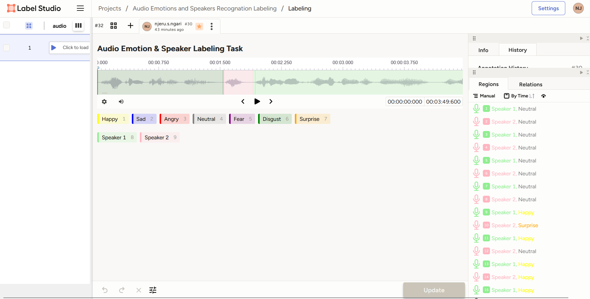

# Audio Emotion and Speaker Recognition Annotation

This project demonstrates annotation of podcast audio using [Label Studio](https://labelstud.io) for two key tasks:

- 🔊 **Speaker Recognition** — Identifying different speakers in dialogue
- 😊 **Emotion Labeling** — Tagging speech segments with emotions like Happy, Neutral, Surprise

The dataset is derived from a podcast clip and annotated manually. The goal is to support training datasets for emotion-aware speech recognition or dialogue systems.

---

## 🔖 Labels Used

- **Speakers:** Speaker 1, Speaker 2
- **Emotions:** Neutral, Happy, Surprise

Each segment was labeled with speaker identity and emotional tone using Label Studio's waveform interface.

---

## 📂 Files in This Repo

- `project-10-*.json` → Full export from Label Studio (JSON format)
- `project-10-*.csv` → Tabular data with timestamps, speakers, and emotion tags

---

## 📊 Screenshot of Annotation Interface

---

## 🔧 Tools Used

- Label Studio (open source annotation tool)
- Audio segments (WAV/MP3 transcription with emotional context)
- Exported in JSON + CSV for analysis and model training

---

## 🔍 Use Cases

- Emotion classification model training
- Audio diarization benchmarking
- NLP-driven conversation analysis

---

## 📢 Author

**Samuel Njeru Ngari**  
Medical AI Data Annotator | NLP Labeler | Transcription QA Expert  
[LinkedIn Profile](https://www.linkedin.com/in/samuelnjerungari/)

Open to freelance projects in AI annotation, healthcare NLP, and dataset QA.
